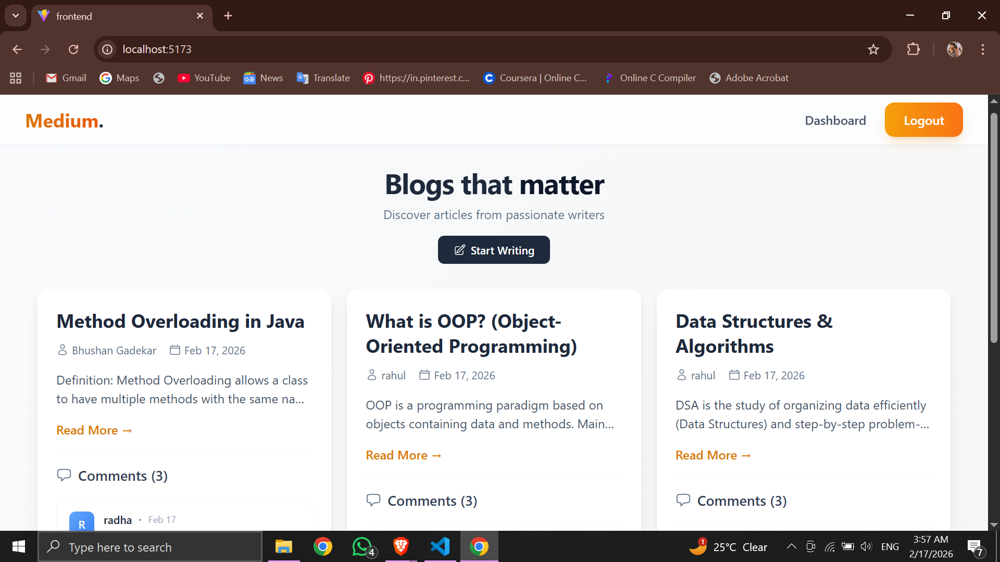
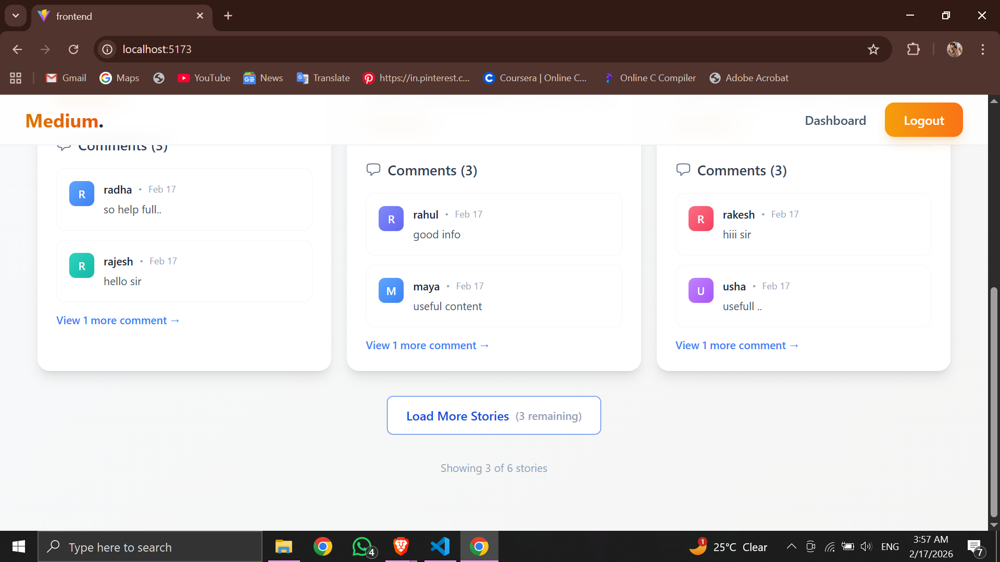
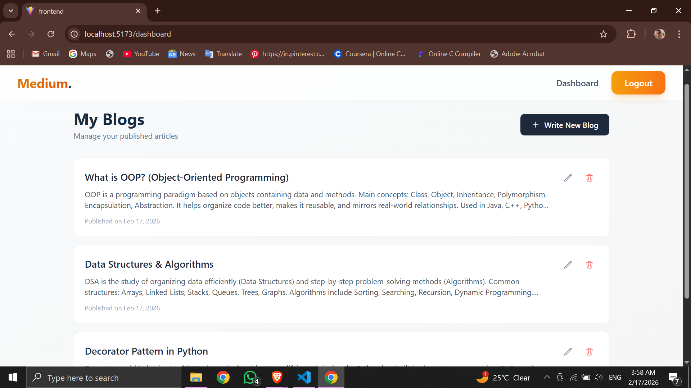

# 📝 Mini Medium Clone - MERN Blogging Platform

A fully functional, production-ready **MERN Stack Blogging Platform** 

Built with clean architecture, JWT authentication, public comment system, and post-owner moderation.

---

## 🚀 Live Features

### 👤 Authentication
- User Registration
- User Login
- JWT Authentication
- Password Hashing (bcrypt)
- Secure Token Handling
- Pagination

### 📝 Blog Posts
- Create Post (Logged-in users)
- Edit Own Post
- Delete Own Post
- Public Post Viewing
- Author Name & Created Date

### 💬 Public Comment System
- Anyone can comment (Guest allowed)
- Name required for comment
- All comments are public
- Only Post Owner can delete comments

### 📊 Dashboard
- Shows logged-in user's posts
- Edit/Delete functionality
- Create new post

---

## 🛠️ Tech Stack

### Frontend
- React (Vite)
- React Router DOM
- Axios
- Tailwind CSS
- Context API
- React Hot Toast

### Backend
- Node.js
- Express.js
- MongoDB
- Mongoose
- JWT
- bcryptjs
- dotenv
- CORS

---

---

## 📸 Application Screenshots

###  Page 1

###  Page 2

###  Page 3

###  Page 4

###  Page 5

---
